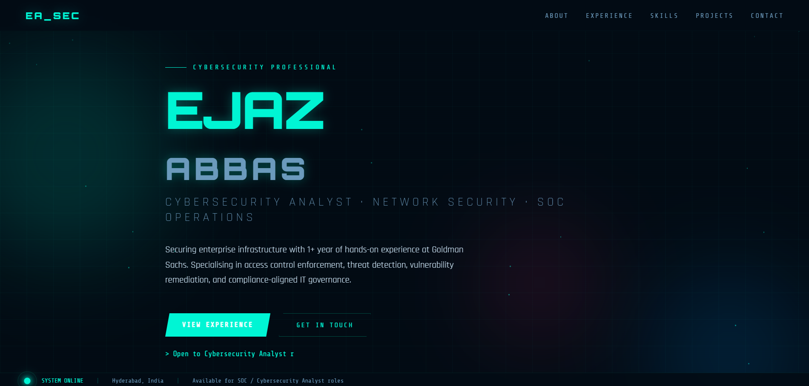

# 🛡️ Ejaz Abbas — Cybersecurity Portfolio

## 🌐 Live Website

https://ejazabbas786.github.io/my-website/

---

## 📌 About Me

Cybersecurity Analyst with hands-on experience in:

* Network Security
* SOC Operations
* Threat Detection & Incident Response
* Vulnerability Management

Focused on securing enterprise environments and improving system security.

---

## 🚀 Features

* Modern cybersecurity-themed UI
* Responsive design
* Projects showcase
* Skills & experience section

---

## 🛠️ Tech Stack

* HTML
* CSS
* JavaScript
* GitHub Pages

---

## 📸 Screenshot

---

## 📬 Contact

* Location: Hyderabad, India
* Role: Open to Cybersecurity Analyst / SOC roles

---

⭐ If you like this project, give it a star!
